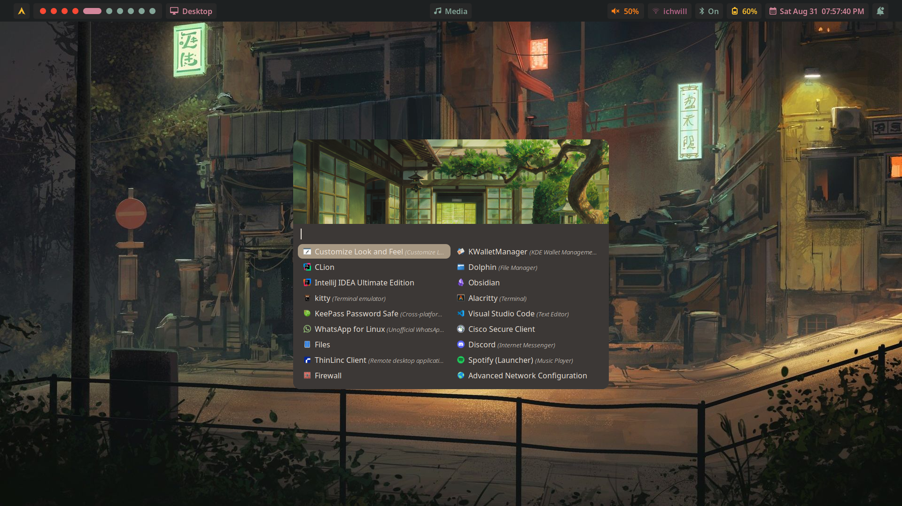
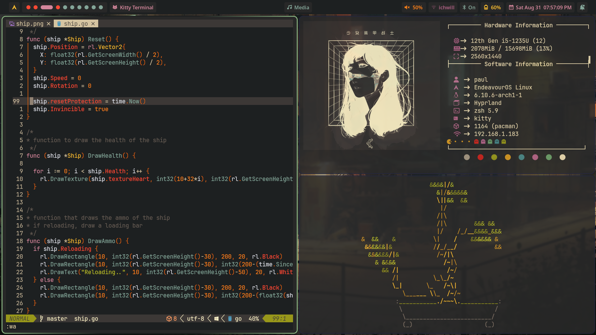
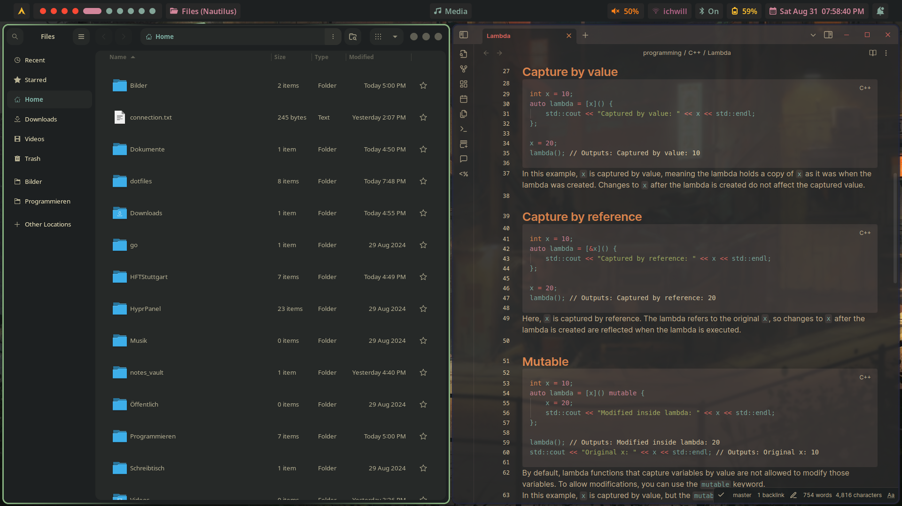

# 【 Hyprland dotfiles 】

## Overview
- [Description](#description)
- [Preview](#preview)
- [Applications](#applications)
- [Installation](#installation)

## Description
This repository contains my personal dotfiles. The hole configuration is based around the colortheme **gruvbox**.
This is my first attempt on a linux rice. I'm using Hyprland as my window manager.
This repostory contains configurations for the applications I use on a daily basis.
It also contains a `.ideavimrc` file for the Vim emulation in IntelliJ IDEA.
This configuration is used on my school laptop. I'm mostly using it for programming and browsing the web.
It also conations my neovim configuration which is set up to work with go, python, rust and c++.

## Preview




## Applications
- **Window Manager**: [Hyprland](https://hyprland.org/)
- **Wallpaper**: Hyprpaper
- **Terminal**: [Kitty](https://sw.kovidgoyal.net/kitty/)
- **Shell**: Zsh
- **Editor**: [Neovim](https://neovim.io/)
- **File Manager**: Nautilus
- **Browser**: Brave
- **Launcher**: [Rofi](https://github.com/lbonn/rofi)
- **Bar**: [Hyprpanel](https://hyprpanel.com/)
- **Notification**: [Hyprpanel](https://hyprpanel.com/)
- **Terminal Prompt**: [Oh-My-Posh](https://ohmyposh.dev/)
- **Neofetch**: [Neofetch](https://github.com/dylanaraps/neofetch)

This repository also contains some configurations for applications that I don't use anymore.
These are:
- **Bar**: Waybar
- **Terminal**: Alacritty
- swaylock
- wlogout


## Installation
1. Clone the repository
```bash
cd ~
git clone https://github.com/Pazl27/dotfiles.git
```
2. Make shure you have the application installed that you want to use.
3. Copy the configuration files to the `.config` directory
```bash
cd dotfiles
cp -r -f .config/[dir_you_want_to_copy] ~/.config/
```
If you have existing configuration files you want to keep, make a backup of them before copying the new ones.
