[](https://git.io/typing-svg)

<div align="center">
<p>
<a href="https://github.com/Pazl27/dotfiles/stargazers"></a>&nbsp;&nbsp;
<a href="https://github.com/Pazl27/dotfiles/forks"></a>&nbsp;&nbsp;
<a href="https://github.com/Pazl27/dotfiles/commits/master/"></a>&nbsp;&nbsp;
<a href="https://github.com/Pazl27/dotfiles/blob/master/LICENSE"></a>&nbsp;&nbsp;
</p>
</div>

# Description
This repository contains my personal dotfiles. The hole configuration is based around the colortheme **gruvbox**.
This is my first attempt on a linux rice. I'm using Hyprland as my window manager.
This repostory contains configurations for the applications I use on a daily basis.
It also contains a `.ideavimrc` file for the Vim emulation in IntelliJ IDEA.
This configuration is used on my school laptop. I'm mostly using it for programming and browsing the web.
It also conations my neovim configuration which is set up to work with go, rust and c++.
My configuration has also integrated ai assistance, which can help you with quick questions or code snippet generation.

# Preview


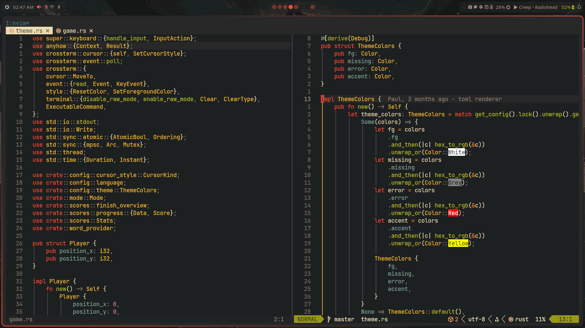
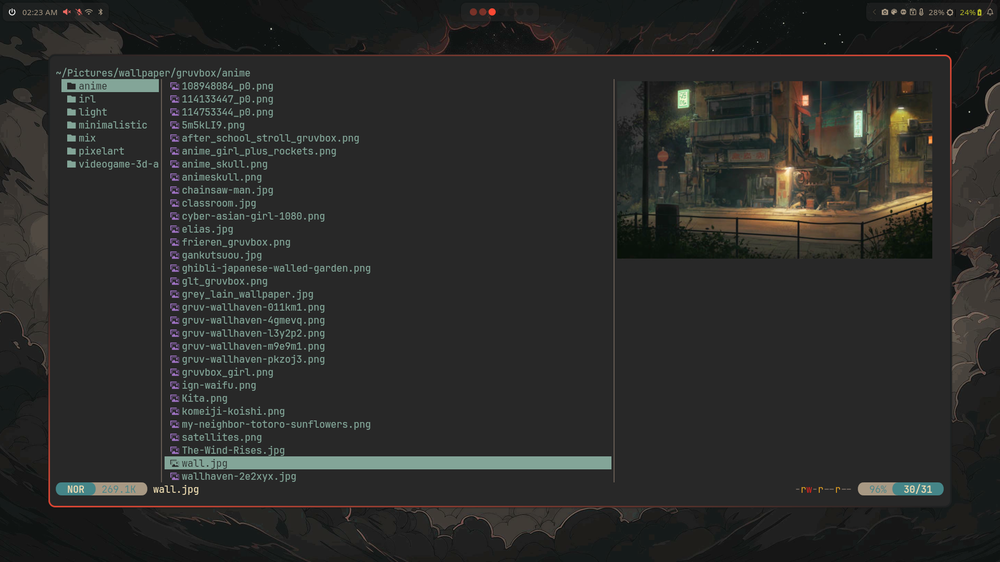

# Applications

<details>
  
  <summary>Waybar</summary>
   

   ### Overview
   This is my Waybar setup for Hyprland, designed to be clean and efficient. It includes all the essential features I wanted in Waybar. For additional needs like volume control, I use swaync, which can be     triggered from Waybar. It is possible to take screenshot, use a color picker or mute the microphone. 

  ### Workspaces
  I've configured the workspaces so that if a workspace contains any open content, its indicator dot appears in a lighter shade of red. This makes it easier to keep track of active workspaces. Initially, only 7         workspaces are displayed, but more are added dynamically as needed when you go beyond 7.
  
   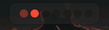

  ### Expanding Widgets 
  On the right side of the Waybar, you'll find the notification module (which opens SwayNC), the battery level, the music display, and the expanding widget.
  Inside the expanding widget, there are several useful tools and statistics. You can monitor key system stats such as temperature, disk space, and CPU usage.
  In addition, there are icons for taking screenshots and using a color picker. You can also adjust the screen brightness directly from this widget.
  
  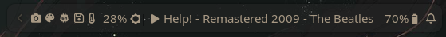

  ### Wifi and Bluetooth
  On the left side of the Waybar, you'll find the following modules: power, clock, sound, Wi-Fi, and Bluetooth.
  Both the Bluetooth and Wi-Fi modules launch a Rofi script when clicked. These scripts make it easy to connect to devices or select and log into Wi-Fi networks.
  The sound module allows you to mute the microphone, and a right-click opens pulsemixer in a floating terminal window.
  The power module opens wlogout. 
  
  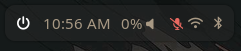

   ### *How To Install*
1. **Install `Waybar`:**

   ```
    sudo pacman -S waybar
   ```
   
2. Copy the `Dotfiles/.config/waybar` folder into `~/.config`


  ## Dependencies
  ```plaintext
  swaync
  grimblast
  hyprpicker
  wl-copy
  wlogout
  rofi
  pulsmixer
  kitty
  ```
   
</details>

<details>
  
  <summary>Rofi</summary>
  
   ### Overview
   This is my roif setup. It is mainly used for launching apps and ssh connections. 
   

  ### *How To Install*
  
1. **Install `Rofi`:**

   ```
    sudo pacman -S rofi-wayland
   ```
   
2. Copy the `Dotfiles/.config/rofi` folder into `~/.config`
3. **Launching Rofi**
    - I launch rofi like this:
   
      ```config
      rofi -show drun 
      ```

</details>

<details>
  
  <summary>Swaync</summary>
   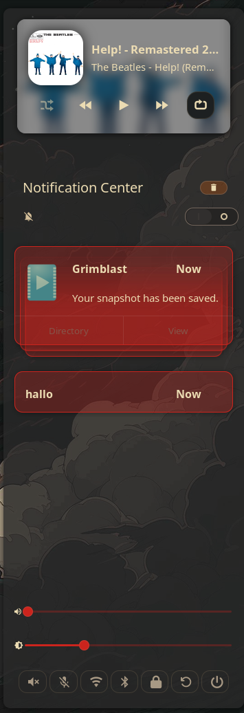

   ### *How To Install*
  
1. **Install `swaync`:**
   
    ```bash
    sudo pacman -S swaync
    ```
2. Copy the `Dotfiles/.config/swaync` folder into `~/.config`

  ### Dependencies for `Swaync`
  ```
  swaync
  rofi
  libnotify
  ```

</details>

<details>
  
  <summary>Neovim</summary>
   

</details>

<details>
  
  <summary>Wlogout</summary>
   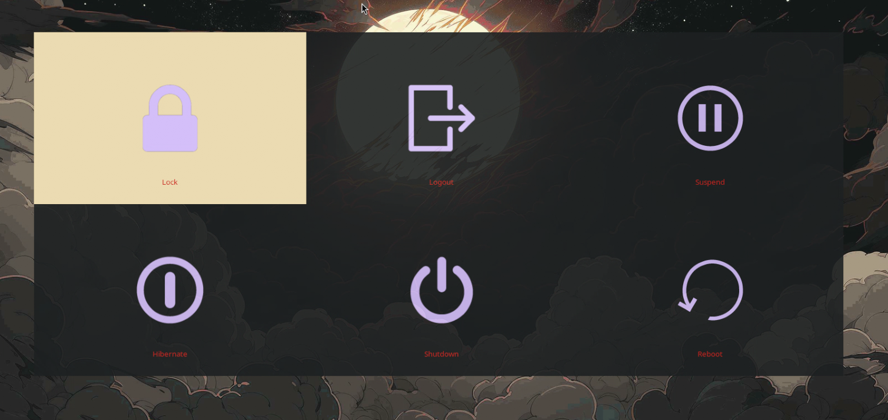
   
   ### *How To Install*
1. **Install `wlogout`:**
   
    ```bash
    yay -S wlogout
    ```
2. Copy `Dotfiles/.config/wlogout` into `~/.config/`
3. If not already set make sure you set a key bind in hyprland.conf to launch wlogout.

</details>


<details>
  
  <summary>Wallpapers</summary>
  
  ## Overview
  
  I use swww to manage and display all my wallpapers seamlessly.

  Most of my Gruvbox wallpapers come from this excellent [repo](https://github.com/AngelJumbo/gruvbox-wallpapers).
  To easily switch between these wallpapers, I utilize a Rofi script bound to the shortcut `Super + G`. This launches a menu listing all available wallpapers, allowing quick and convenient selection.
  

  ### Dependencies
  Make sure you have the following installed:
  ```
  rofi-wayland
  swww
  ```

</details>

---

# Keyboard Shortcuts

These are the keybindings I use in Hyprland, configured in my `keymaps.conf`.  
The `SUPER` key refers to the **Windows** or **Command** key on most keyboards.

| Shortcut                            | Action Description                                  |
|-------------------------------------|-----------------------------------------------------|
| <kbd>Super</kbd> + <kbd>Return</kbd>        | Open terminal (`kitty`)                             |
| <kbd>Super</kbd> + <kbd>Q</kbd>            | Kill the active window                              |
| <kbd>Super</kbd> + <kbd>M</kbd>            | Exit Hyprland session                               |
| <kbd>Super</kbd> + <kbd>Shift</kbd> + <kbd>E</kbd> | Open file manager (`nautilus`)                |
| <kbd>Super</kbd> + <kbd>E</kbd>            | Launch terminal file manager (`yazi.sh`)            |
| <kbd>Super</kbd> + <kbd>B</kbd>            | Open browser (`zen-browser`)                        |
| <kbd>Super</kbd> + <kbd>V</kbd>            | Toggle floating mode                                |
| <kbd>Super</kbd> + <kbd>Space</kbd>        | Open app launcher (`rofi -show drun`)               |
| <kbd>Super</kbd> + <kbd>P</kbd>            | Open resolution switcher (`rofi/resolution.sh`)     |
| <kbd>Super</kbd> + <kbd>F</kbd>            | Toggle fullscreen                                   |
| <kbd>Super</kbd> + <kbd>D</kbd>            | Toggle split layout (dwindle only)                  |
| <kbd>Super</kbd> + <kbd>N</kbd>            | Open terminal with notes (`open_notes.sh`)          |
| <kbd>Super</kbd> + <kbd>W</kbd>            | Open WiFi selector (`rofi/wifi.sh`)                 |
| <kbd>Super</kbd> + <kbd>G</kbd>            | Switch wallpaper (`rofi/wallpaper_switcher.sh`)     |
| <kbd>Super</kbd> + <kbd>A</kbd>            | Launch AI assistant (`askai.sh`)                    |
| <kbd>Super</kbd> + <kbd>Shift</kbd> + <kbd>S</kbd> | Take screenshot (`snapshot.sh`)             |
| <kbd>Super</kbd> + <kbd>I</kbd>            | Open logout screen (`wlogout`)                      |

---

# Ai assistant
This dotfiles setup includes a minimal yet powerful **AI assistant workflow**, tightly integrated with the Linux desktop via [Rofi](https://github.com/davatorium/rofi), [Gemini API](https://ai.google.dev), and [Glow](https://github.com/charmbracelet/glow) for terminal markdown rendering.

### Features

- Triggered with a keyboard shortcut (<kbd>Super</kbd> + <kbd>A</kbd>).
- Prompt input via Rofi dmenu.
- AI responses fetched using [Gemini 2.0 Flash](https://ai.google.dev/) (with **free API key**).
- Response rendered beautifully in a floating `kitty` terminal using `glow`.

##  How it works

1. Press your configured keybinding (<kbd>Super</kbd> + <kbd>A</kbd>).
2. Rofi pops up asking for your question.
3. Your input is sent to the Gemini API via a small Bash script.
4. The markdown-formatted AI response is saved to a temporary file.
5. A floating `kitty` window opens, displaying the answer with `glow`.

### Screenshots

#### 1. Prompt Input via Rofi
> Ask your question directly via a clean Rofi popup


#### 2. Markdown Output in Terminal
> Answer rendered with `glow` in a floating kitty window

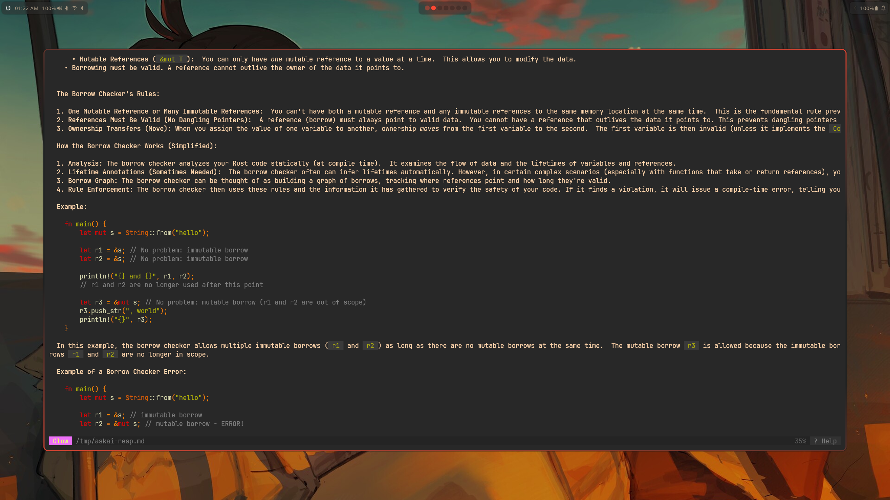

### Config Notes

- The Gemini API key is sourced from a `.env` file to keep it out of version control.
- Kitty is launched with a custom script to ensure the display floats and closes on demand the floating behavior is regulated with the hyprland config and classes.
- `glow` is used for TUI markdown reading — clean and readable.


### Scripts location

You’ll find the related scripts inside:
`~/.config/scripts/rofi/ai/`

Main scripts:
- `askai.sh` — handles prompt input and API call
- `display-resp.sh` — renders the markdown response with glow

---

# Keyboard

I use a **Corne (crkbd) v4** keyboard — a split, column-staggered 40% layout with 3 layers. Mine is the **wired version**, and I got it from [KeebArt](https://www.keebart.com/de/produkte/corne). It's compact, ergonomic, and a joy to type on once you get used to the layering system.  

I use **Vial** to configure and flash my keymap. Vial makes it easy to customize layers, remap keys on the fly, and store changes directly in the keyboard’s memory.


## My Layer Setup

I use a total of **three layers**:

### Layer 0 – Typing Layer (QWERTZ)
This is my main typing layer, customized for the German QWERTZ layout. It includes standard alphanumeric keys and a few custom modifiers.

**Visual:**
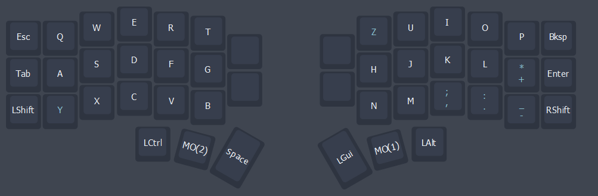

---

### Layer 1 – Numbers & Symbols  
This layer gives quick access to:
- Numbers (0–9)
- Common symbols like `!`, `=`, `#`, `*`, `&` etc.
- Brackets and mathematical operators

**Visual:**
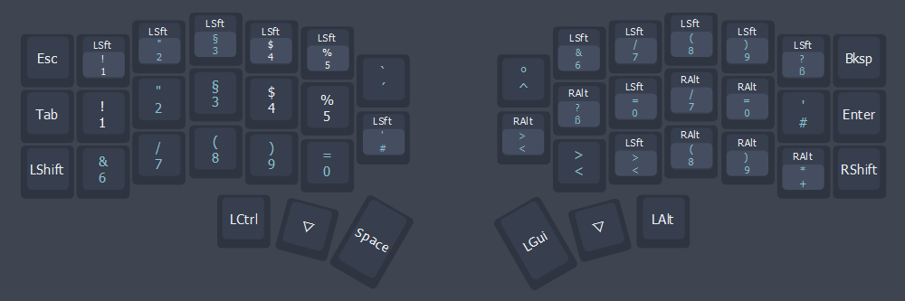

---

### Layer 2 – German Letters, Arrows & Media  
This layer adds:
- German-specific characters like `ä`, `ö`, `ü`, `ß`
- Symbols like `@`, `€`, etc.
- Arrow keys
- Media controls (volume, play/pause, etc.)

**Visual:**
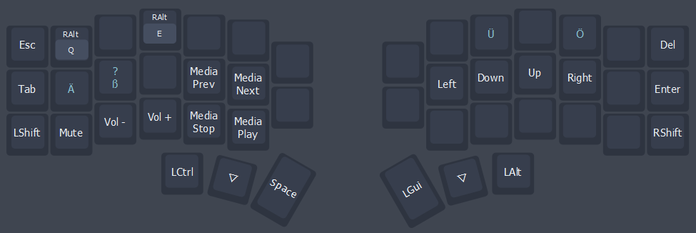

---

# Installation
1. Clone the repository
```bash
cd ~
git clone https://github.com/Pazl27/dotfiles.git
```
2. Make sure you have the application installed that you want to use.
3. Copy the configuration files to the `.config` directory
```bash
cd dotfiles
cp -r -f .config/[dir_you_want_to_copy] ~/.config/
```
If you have existing configuration files you want to keep, make a backup of them before copying the new ones.
It is also possible to apply the configuration with the help of stow. 
```bash
cd dotfiles
stow .
```
